# Tarea Evaluable Docker

**CIFP La Laboral - Módulo Despliegue de Aplicaciones Web**

> 👥 **Autores:** Iker y Pelayo Rodríguez                                                                                                                                   📌 **Fecha de entrega y exposición:** Viernes, 21 de febrero de 2025.                                                                                                                                     📂 **Repositorio GitHub:** ‣
> 

# 📑 ÍNDICE

| 📝 | 1. Descripción del Proyecto |
| --- | --- |
| ⚙️ | 2. Instrucciones Generales |
| 👥 | 3. Asignación de tareas |
| 📁 | 4. Estructura del Repositorio |
| üìö | 5. Ejercicios |
|  | 5.1 Manual de Docker Desktop |
|  | 5.2 Servidor de Base de Datos |
|  | 5.3 Contenedores en Red |
|  | 5.4 Docker Compose |
|  | 5.5 Imagen con Dockerfile - Aplicación Web |

## 📝 Descripción del Proyecto

Este repositorio contiene la resolución de la **Tarea Evaluable Docker**, organizada en cinco ejercicios prácticos relacionados con la gestión de contenedores Docker, redes y despliegue de aplicaciones web.

## ⚙️ Instrucciones Generales

- **üë• Trabajo en equipo:** Grupo compuesto por 2 personas(Pelayo e Iker).
- **📂 Repositorio en GitHub:** Tenemos una persona que creó el repositorio(Pelayo) y otra colaboradora(Iker).
- **🌱 Uso de ramas:** Trabajamos con branches para una correcta organización del código.
- **üìå Registro de contribuciones:** Los commits reflejan las aportaciones de cada miembro del equipo.
- **✅ Asignación de tareas:** Documentación de la distribución de tareas, plazos y porcentaje de cumplimiento en un documento del repositorio.
- **🗃️ Estructura del repositorio:** Contamos con una carpeta para cada ejercicio con la documentación y los archivos necesarios.
- **üìë Entrega final:**  Documento en PDF con nuestros nombres y la URL del repositorio.

## 👥 ASIGNACIÓN DE TAREAS

[ToDo](ToDo%2019851fe9844080a6abddc98573e9407c.csv)

## 📁 ESTRUCTURA DEL REPOSITORIO

```
📂 proyecto-docker/
├── 📁 Ejercicio_1/
│   ├── 📄 manual_docker.md
│   ├── 📸 imagenes/
│   └── 📑 manual_docker.pdf
│
├── 📁 Ejercicio_2/
│   ├── 📄 servidor_base_datos.md
│   ├── 📸 imagenes/
│   └── 📑 servidor_base_datos.pdf
│
├── 📁 Ejercicio_3/
│   ├── 📄 comandos_red.md
│   ├── 📸 imagenes/
│   └── 📑 comandos_red.pdf
│
├── 📁 Ejercicio_4/
│   ├── ⚙️ docker_compose.yaml
│   ├── 📸 imagenes/
│   ├── 📄 docker_compose.md
│   └── 📑 docker_compose.pdf
│
├── 📁 Ejercicio_5/
│   ├── 🐳 Dockerfile
│   ├── 🌐 index.html
│   ├── 🎨 styles.css
│   ├── 🔧 script.php
│   ├── 📸 imagenes/
│   ├── 📝 docker_commands.txt
│   ├── 📄 dockerfile.md
│   └── 📑 dockerfile.pdf
│
└── 📄 README.md
```

## üìñ Ejercicios

### 🖥️ Ejercicio 1: Manual de Docker Desktop

### 💾 Proceso paso a paso de instalación

- **Abrimos el navegador** y accedemos a la p√°gina oficial de Docker:

  üëâ[üîó P√°gina oficial de Docker Desktop](https://www.docker.com/products/docker-desktop)

- Bajamos un poco pinchamos en Download Docker Desktop y lo descargamos para Windows.


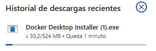

Una vez descargado, pinchamos en el instalador y comenzamos con la descarga:

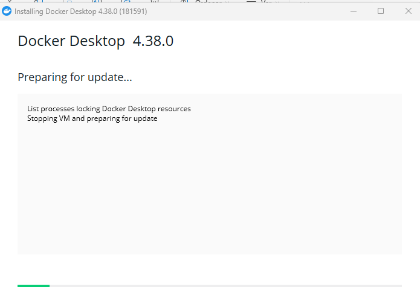


Una vez realizada la instalación, accedemos a Docker Desktop:

Nada mas entrar nos pedirá iniciar sesión o registrarnos:

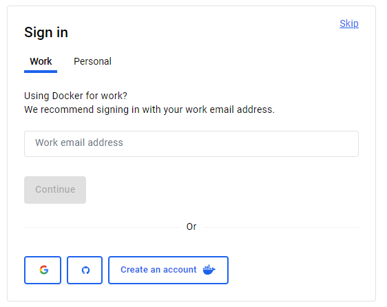

Una vez hecho, ya accedemos a Docker Desktop y a todas sus funcionalidades: 

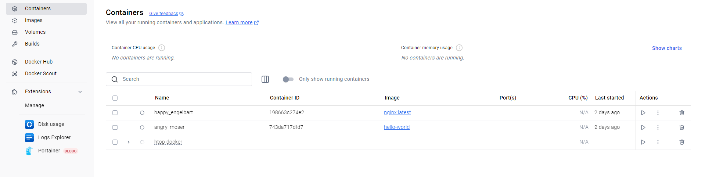

### 🖥️ Navegación por la interfaz principal


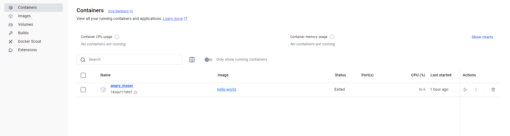

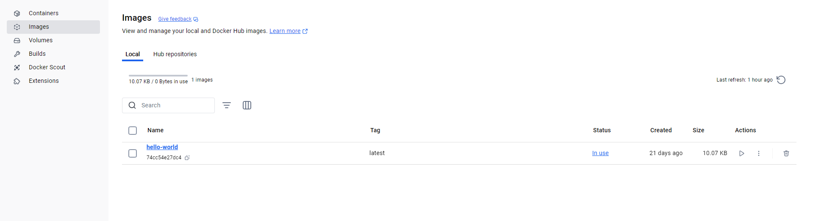

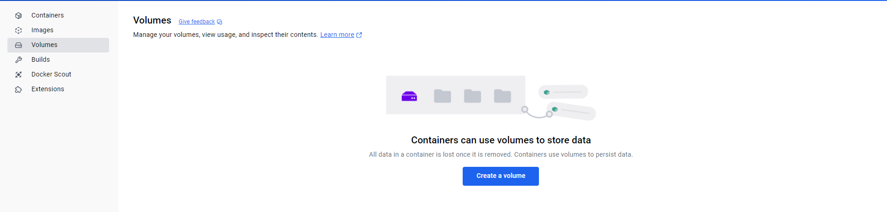

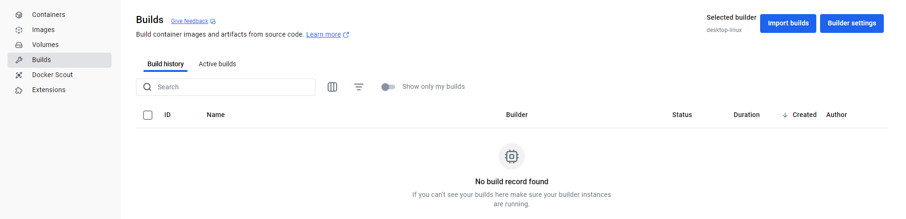

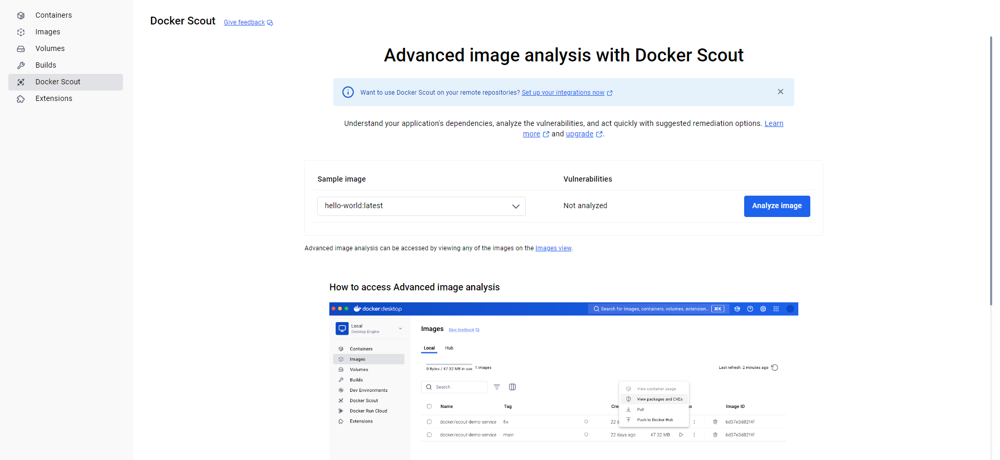

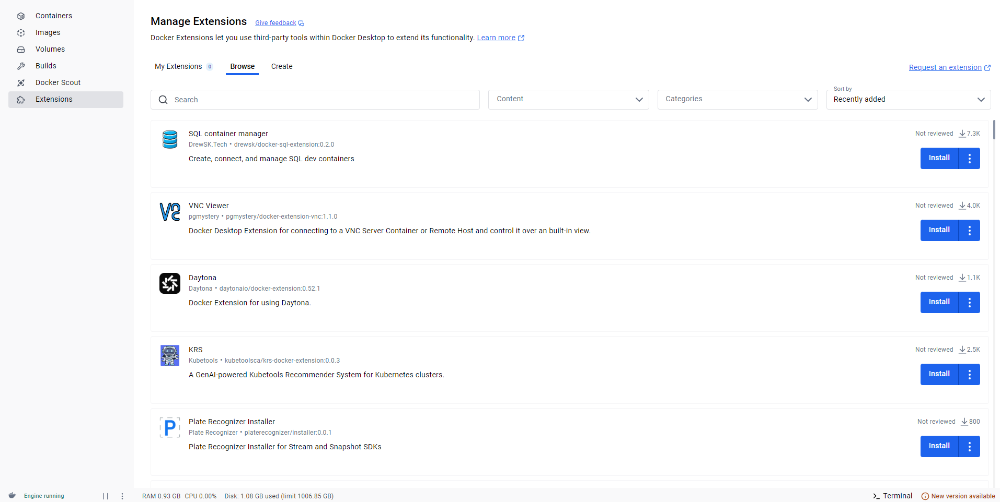

### 📦 Operaciones básicas con contenedores

***Ver Contenedores Disponibles***

- Abrimos **Docker Desktop**.
- En la barra lateral izquierda, seleccionamos **Containers**.
- Se muestra una lista con los contenedores creados, indicando su estado (corriendo, detenido, etc.).

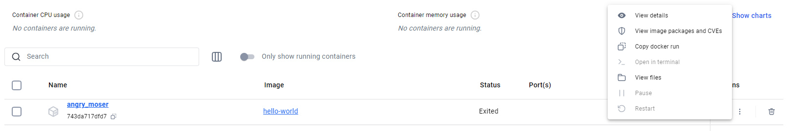

***Iniciar un Contenedor Detenido***

- Ubicamos el contenedor en la lista.
- Si el estado es "Exited", hacemos clic en los tres puntos **(⋮)** a la derecha del contenedor.
- Seleccionamos Restart para reiniciarlo.

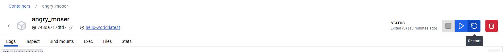

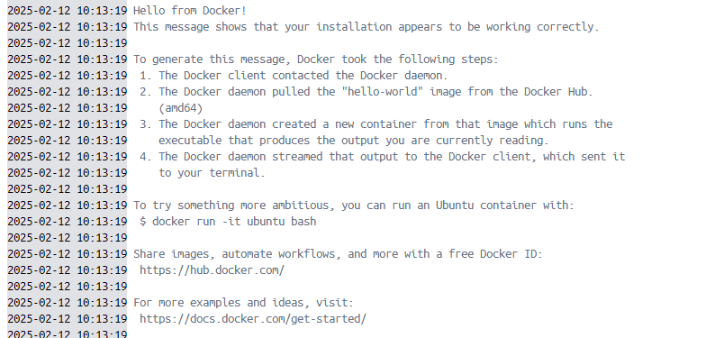

***Detener un Contenedor en Ejecución***

- Usamos el contenedor en ejecución.
- Le damos a los tres puntos **(⋮)**.
- Selecciona **Pause** o **Stop** seg√∫n sea necesario.

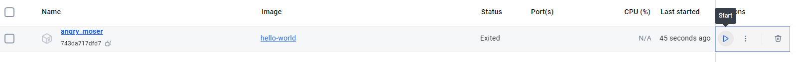

***Eliminar un Contenedor***

- Nos aseguramos de que el contenedor est√° detenido.
- Hacemos clic en los tres puntos **(⋮)** a la derecha del contenedor.
- Seleccionamos el icono de **Eliminar** para eliminarlo.

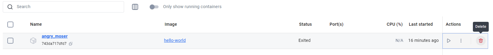

***Ver Detalles de un Contenedor***

- Hacemos clic en los tres puntos **(⋮)** a la derecha del contenedor.
- Seleccionamos view details.
- Al entrar, podemos ver información como logs, configuración y estadísticas de uso.

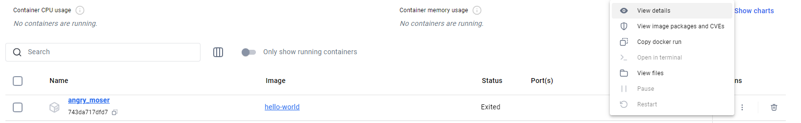

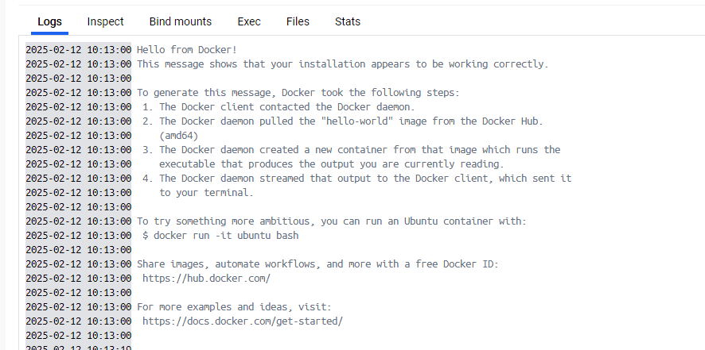

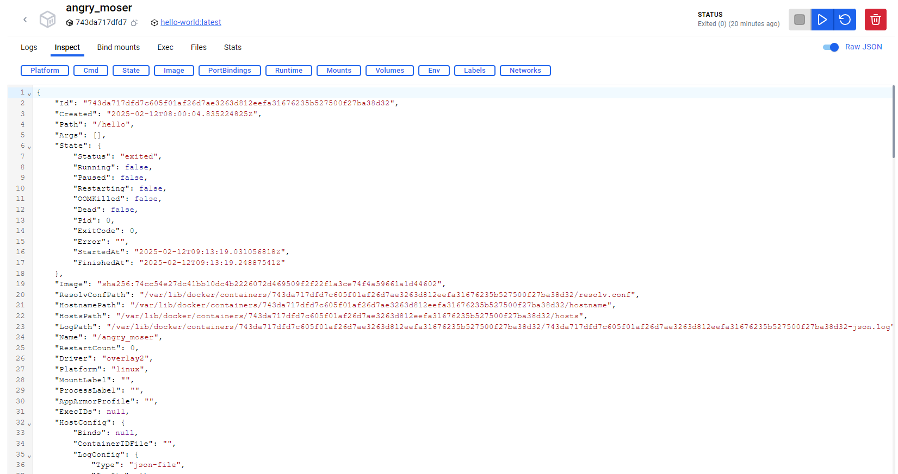

***Copiar el Comando de Ejecución de un Contenedor***

- Hacemos clic en los tres puntos **(⋮)** junto al contenedor.
- Seleccionamos **Copy docker run** para copiar el comando con el que fue creado.

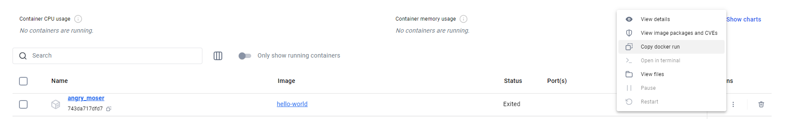

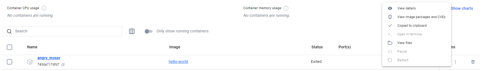

***Ver Archivos de un Contenedor***

- Hacemos clic en los tres puntos **(⋮)**.
- Seleccionamos **View files** para explorar los archivos dentro del contenedor.

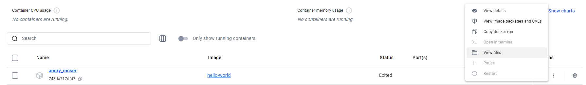

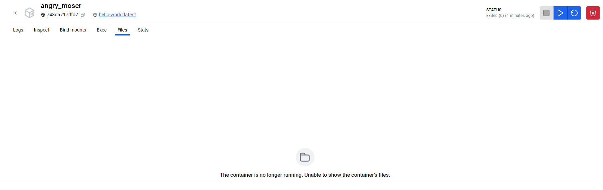

## 🏷️ Gestión de imágenes Docker

***Ver las Im√°genes Disponibles***

- En la barra lateral izquierda, seleccionamos **Images**.
- Se nos muestra la lista de im√°genes descargadas en el sistema.

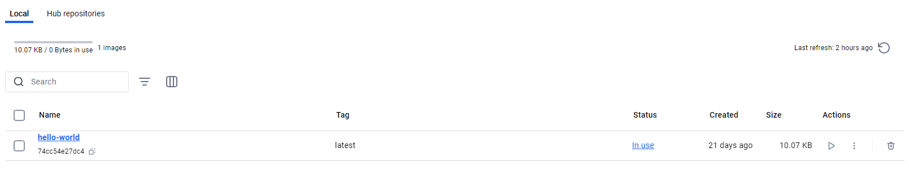

***Descargar una Imagen desde Docker Hub***

- Descargamos la imagen manualmente con:

```bash
$docker pull nginx:latest
```

- Vamos a la pestaña **Images**.
- Hacemos clic en el botón **Pull** (Descargar).
- Escribimos el nombre de la imagen y su versión, por ejemplo:

```bash
$nginx:latest
```

- Haz clic en **Pull** para descargar la imagen.

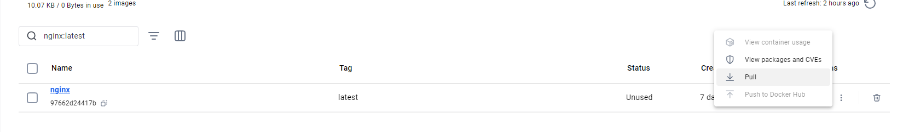

***Eliminar una Imagen***

1. Encontramos la imagen que queremos borrar en la pestaña **Images**.
2. Hacemos clic en el icono de los tres puntos **(⋮)** a la derecha.
3. Seleccionamos **Delete** para eliminar la imagen.

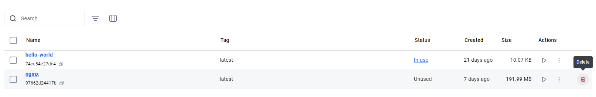

No se pueden eliminar imágenes que están en uso por un contenedor en ejecución:

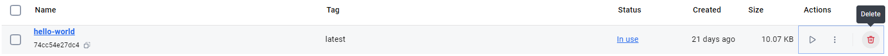

***Crear una Imagen Personalizada***

- Escribimos un **Dockerfile** con la configuración de la imagen.
- Usamos el siguiente comando en la terminal:
  
    ```bash
    $docker build -t mi-imagen .
    ```
    
- Posteriormente, la imagen nos aparece en la pestaña **Images**.

***Ejecutar un Contenedor desde una Imagen***

- Encontramos la imagen que queremos ejecutar.
- Hacemos clic en **Run**.
- Configuramos los puertos y vol√∫menes si es necesario y hacemos clic en Run.

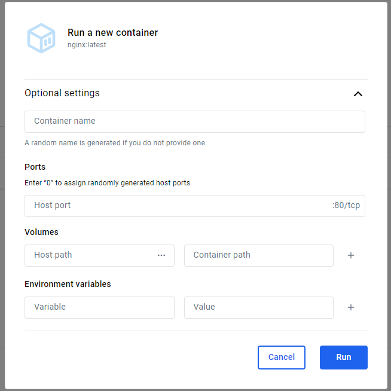

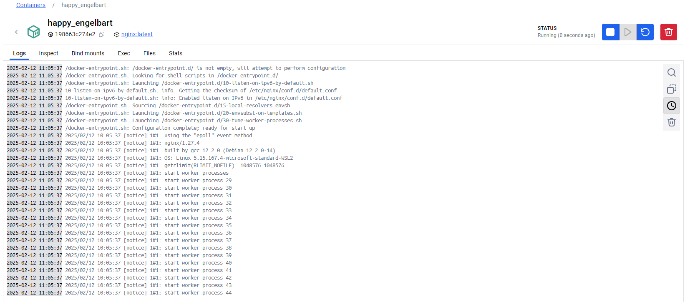

### 🔌 Configuración de redes y volúmenes

***Ver las redes disponibles***

- En la barra lateral, seleccionamos **Containers**.
- Hacemos clic en un contenedor existente y seleccionamos **View details**.
- En la pestaña **Network**, vemos las redes asociadas al contenedor.

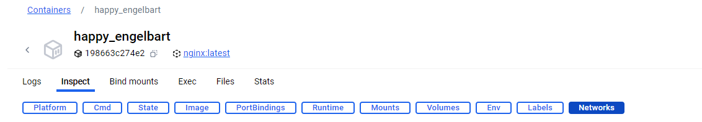

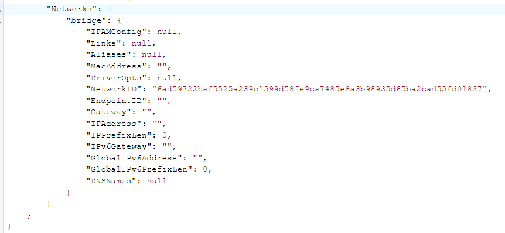

***Crear una Nueva Red***

Docker Desktop no ofrece una opción nativa para añadir redes directamente desde su interfaz, pero podemos utilizar extensiones de terceros para ampliar su funcionalidad.

- Hacemos clic en la pestaña **Extensions** en la barra lateral izquierda.
- En el Marketplace de Extensiones, buscamos **Portainer**.
- Hacemos clic en **Install** para añadir la extensión.


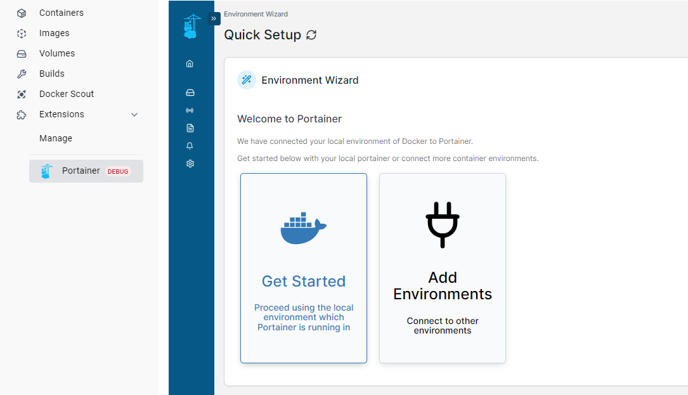

- Configuramos el entorno

Al iniciar Portainer por primera vez, verás la pantalla de "Quick Setup" (como en tu imagen). Aquí puedes:

- **"Get Started"**: Gestionamos el entorno local de Docker donde se ejecuta Portainer.

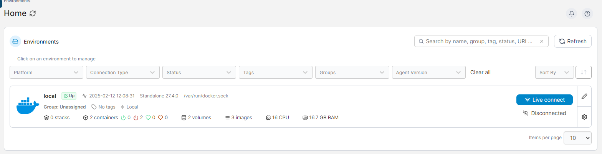

- **"Add Environments"**: Agregamos otros entornos remotos, como cl√∫steres de Kubernetes o instancias Docker en servidores.

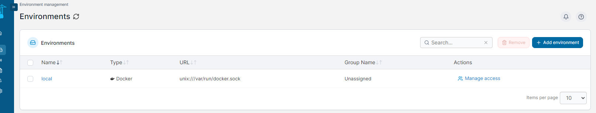

- Administramos contenedores

Desde el panel de control de Portainer, puedes:

- Crear, iniciar, detener y eliminar contenedores.
- Ver logs y estadísticas de rendimiento.
- Gestionar im√°genes y vol√∫menes de Docker.
- Configurar redes y stacks con Docker Compose.

### 🔧 Herramientas de diagnóstico

### **Disk Usage (Uso de Disco)**

- Muestra cu√°nto espacio ocupan las im√°genes, contenedores y vol√∫menes.
- Ideal si Docker usa demasiado espacio en disco.

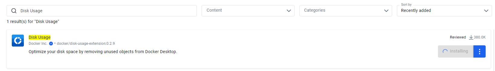

- Una vez instalada, vamos a **"Extensions" > "Disk Usage"**.
- Revisamos el uso de espacio y liberamos lo que no necesitemos.

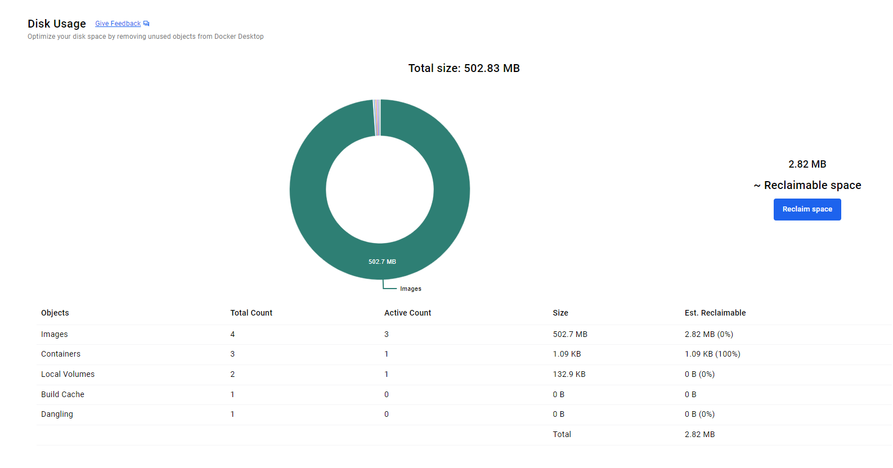

### **Logs Explorer (Explorador de Logs)**

- Permite ver los logs de todos los contenedores sin usar la terminal.
- Muy √∫til para detectar errores sin ejecutar `docker logs`.

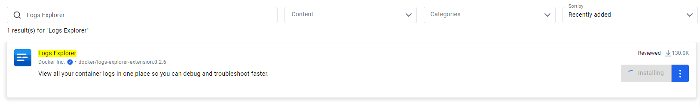

- Vamos a **"Extensions" > "Logs Explorer"**.
- Seleccionamos el contenedor que queremos analizar y revisamos los logs en la interfaz.

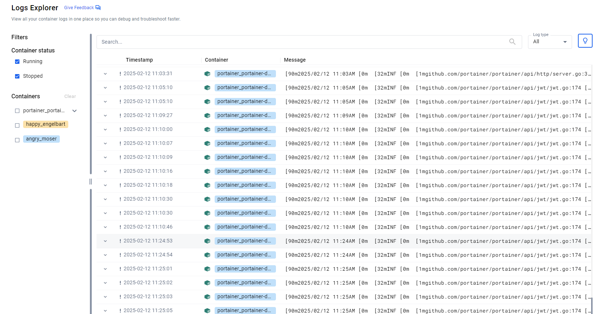

### 🛢️ Ejercicio 2: Servidor de Base de Datos

***Descargar la imagen de MariaDB***

- Buscamos la imagen de **mariadb** y la descargamos
- En el menú de Docker Desktop, seleccionamos la pestaña **"Images"** (Imágenes).
- En la barra de búsqueda, escribimos **"mariadb🦭"**.
- Aparecen varias opciones relacionadas con MariaDB, selccionamos la primera.

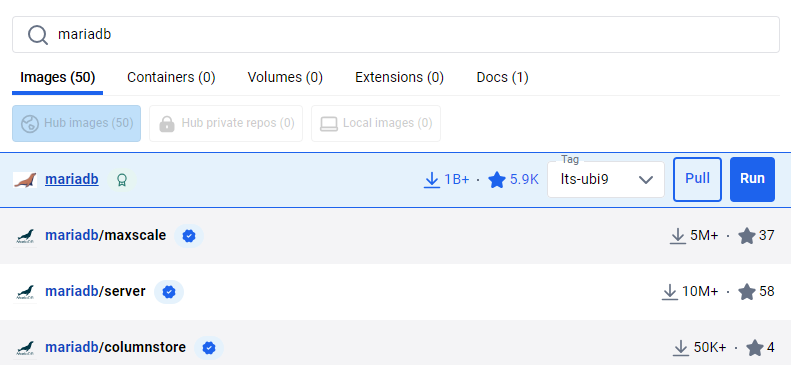

- Identificamos la imagen correcta con el nombre **"mariadb🦭"** y el ícono oficial.
- Verificamos que tiene **m√°s de 1B+ descargas** y **5.9K estrellas** (esto confirma que es la imagen m√°s utilizada y confiable).
- Hacemos clic en la imagen para seleccionarla.

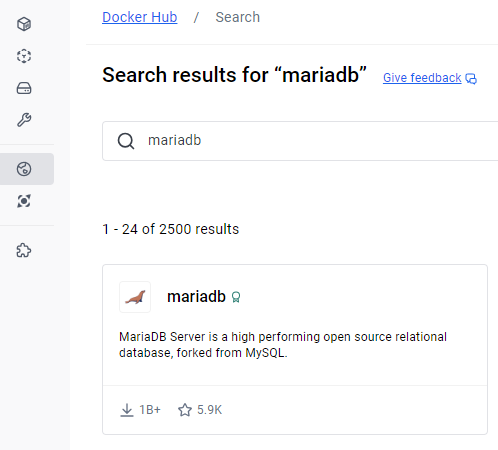

***Verificación que la imagen se descargó correctamente***

- Vamos nuevamente a la pestaña "Images".
- Ahora, la imagen de MariaDB nos aparece en la lista de im√°genes disponibles en tu sistema.

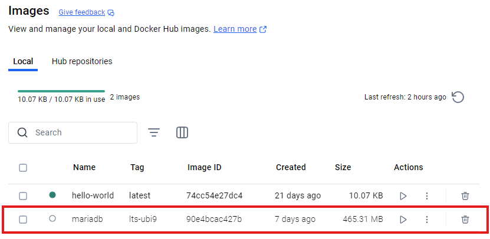

***Crear un contenedor con MariaDB***

- Vamos a la pestaña **Images** y haz clic en **Run** con la imagen de **MariaDB** que descargamos.
- Configuramos los siguientes par√°metros en Optional Settings:
    - **Nombre del contenedor**: `bbdd`
    - **Puerto**: **3306** (nos aseguramos de exponerlo para conexiones externas)
    - **Volumen**: Creamos un volumen llamado `datos-mariadb`.
        - En **Host path**, escribimos el nombre del volumen `datos-mariadb` .
        - En **Container path**, asignamos la ruta donde MariaDB guarda los datos dentro del contenedor  /var/lib/mysql  que es la ruta por defecto donde MariaDB almacena sus datos en el contenedor.
    - **Variables de entorno**:
        - `MYSQL_ROOT_USER=root`
        - `MYSQL_ROOT_PASSWORD=root`
        - `MYSQL_DATABASE=base`
        - `MYSQL_USER=daw`
        - `MYSQL_PASSWORD=daw`
- Guardamos y le damos a Run.

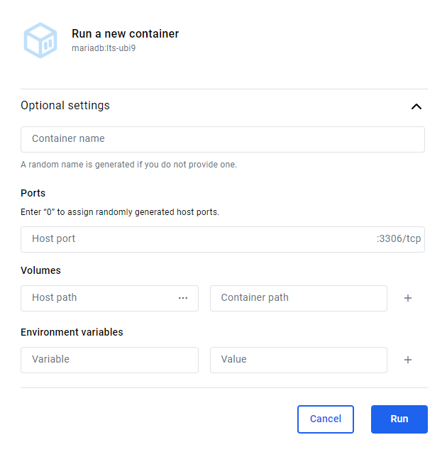


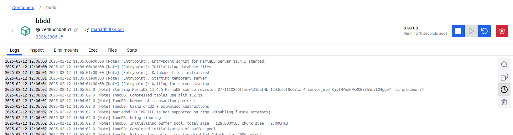

***Conectarse a la base de datos con DBeaver***

- Abrimos **DBeaver**
- Creamos una nueva conexión:
    - Configuración general:
        - **Host**: `localhost`
        - **Puerto**: `3306`
    - Credenciales:
        - **Usuario**: `daw`
        - **Contraseña**: `daw`
    - Base de datos:
        - **Base de datos**: `base`

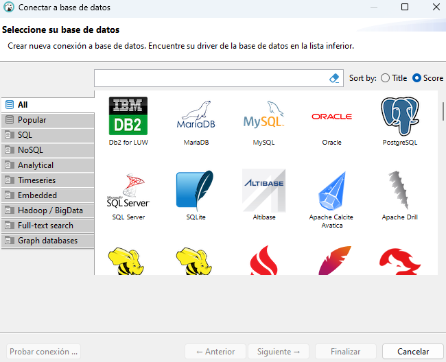

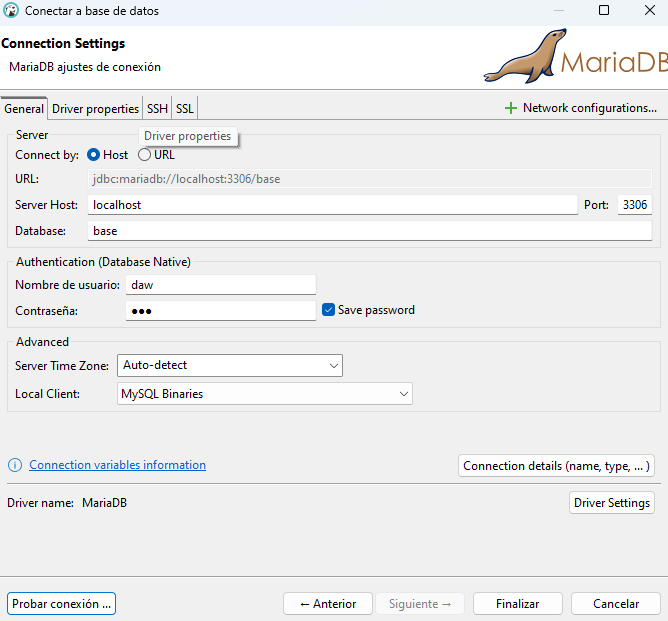

***Probamos la conexión y nos aseguramos de que funciona.***

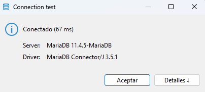

 ***Crear una nueva base de datos***

- Hacemos clic derecho en la conexión con **MariaDB** y seleccionamos **"Crear Nuevo Database"**.
- Se nos abre una ventana llamada **"Create database"**.
- En **Database name**, escribimos el nombre de la base de datos, en este caso la llamamos `dbPelayoIker.`
- En **Charset**, seleccionamos **utf8mb4** (para compatibilidad con caracteres especiales y emojis).
- Opcionalmente, podiamos configurar **Collation**, pero en este caso lo dejarlo vacío para la opción por defecto.
- Hacemos clic en **"Aceptar"** para crear la base de datos.

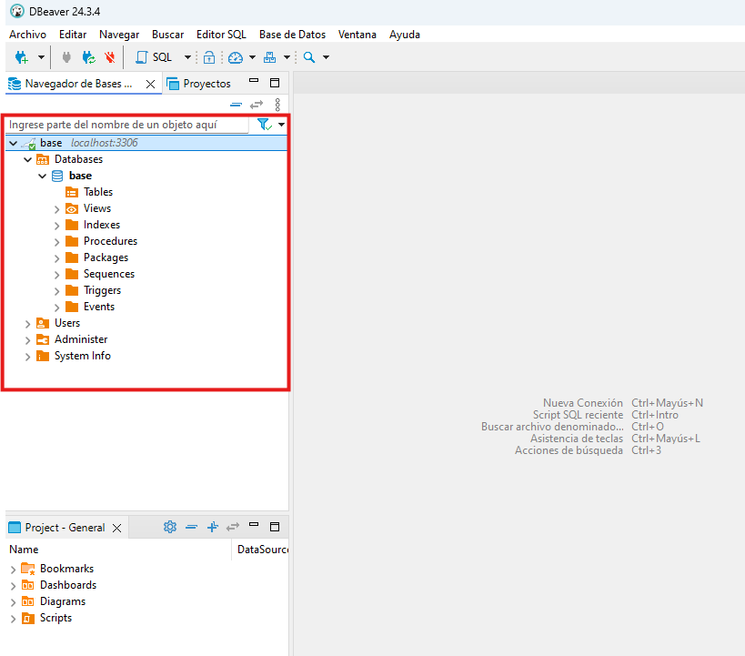

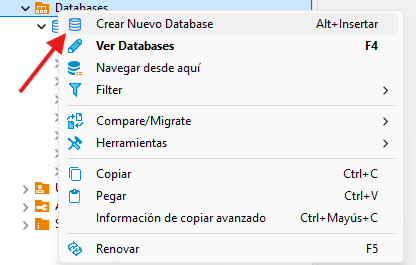

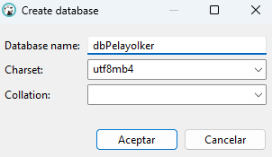

***Seleccionamos la base de datos y crear una tabla***

- Hacemos clic derecho sobre la base de datos `dbPelayoIker` que acabamos de crear.
- Luego, hacemos clic derecho en **"Tables"** ‚Üí **"Create New Table"**.
- Asignamos un nombre a la tabla , le ponemos por ejemplo,`ejemplo`.
- Agregamos las columnas necesarias:
    - `id` → **INT**, los marcamos como **Primary Key**, opción **Auto Increment**.
    - `nombre` ‚Üí **VARCHAR(50)**, lo marcamos como **NOT NULL**.
- Guardamos los cambios y presionamos en **"Aceptar"**.

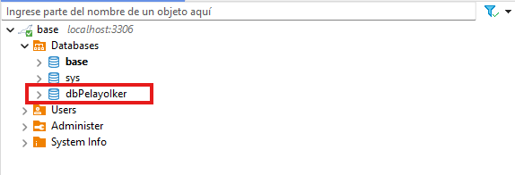

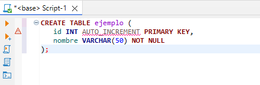

***Verificamos que la tabla se creo correctamente***

- Expandimos la base de datos `dbPelayoIker` en el panel izquierdo y hacemos clic en **"Tables"**.
- Vemos la tabla `ejemplo`, con lo cual se ha creado correctamente.

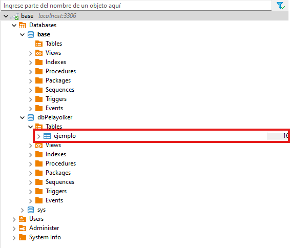

***Detener y eliminar los contenedores***

- Abrimos **Docker Desktop**.
- En la pestaña **Containers**, buscamos el contenedores `bbdd`.
- Detenemos cada contenedor presionando el botón **Stop (🟥)**.
- Luego, eliminamos los contenedores con el botón **Delete (🗑️)**.

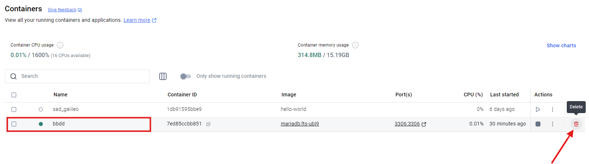

***Verificamos que el volumen "datos-mariadb" sigue existiendo***

- En Docker Desktop, vamos a la pestaña **Volumes**.
- Buscamos el volumen `datos-mariadb`.
- Como se ve el volumen sigue ahi, lo que significa que los datos no se han perdido.

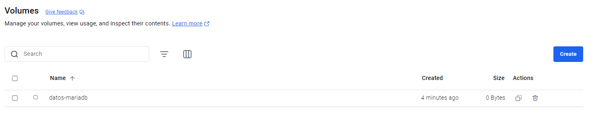

***Creamos otro contenedor con el mismo volumen***

- En Docker Desktop, vamos a **Images** y buscamos **MariaDB**.
- Hacemos clic en **Run** para desplegar un nuevo contenedor.
- Configuramos:
    - **Container name**: `bbdd-2`
    - **Port**: `3306`
    - **Volume**: `datos-mariadb`
    - **Environment variables** (como antes):
        - `MYSQL_ROOT_USER=root`
        - `MYSQL_ROOT_PASSWORD=root`
        - `MARIADB_DATABASE=base`
        - `MARIADB_USER=daw`
        - `MARIADB_PASSWORD=daw`
- Hacemos clic en **Run**.


***Comprobamos que los datos siguen en el nuevo contenedor***

- Abrimos **DBeaver** y nos **conectatamos de nuevo a MariaDB** (`localhost:3306`, usuario `daw`).
- Verificamos que `dbPelayoIker` y la tabla `ejemplo` siguen existiendo.
- Como todo est√° correcto, los datos se han conservado gracias al volumen persistente.

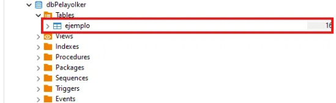

***Intentar borrar la imagen de MariaDB***

- En Docker Desktop, vamos a la pestaña **Images**.
- Intentamos eliminar la imagen de **MariaDB** (`Delete`).
- **¿Qué sucede?**
    - No podremos eliminar si hay contenedores en ejecución usándola (`bbdd-2`).
    - Tenemos que eliminar `bbdd-2` antes de poder borrar la imagen.

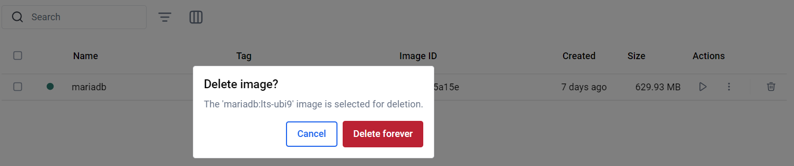

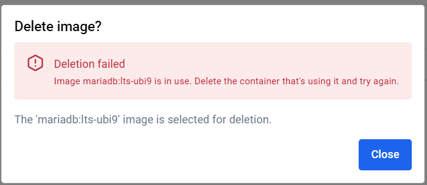

***Borrar todo (Volumen, Imagen y Contenedor)***

- Eliminamos los contenedor **`bbdd`** y **`bbdd-2`** desde Docker Desktop.

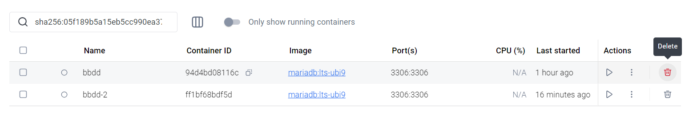

- Eliminamos el volumen **`datos-mariadb`** desde la pestaña **Volumes**.

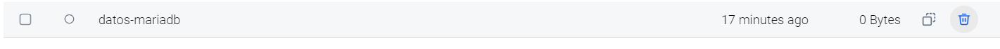

- Eliminamos la imagen de MariaDB desde la pestaña **Images**.

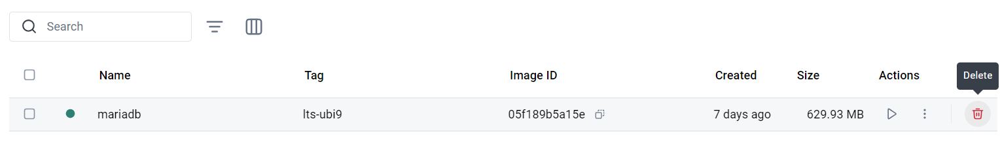

### üåê Ejercicio 3: Contenedores en Red

### 🛠️ Crear una red bridge (redbd)

En **Docker Desktop**, no hay una sección visual para redes en la interfaz, pero podemos verlas y administrarlas con comandos Docker.

Primero listamos las redes, luego, creamos la red bridge pedida y por ultimo vemos los detalles de esa red y comprobamos que se ha creado correctamente:

```bash
 $docker network ls
 $docker network create redbd
 $docker network inspect redbd
```

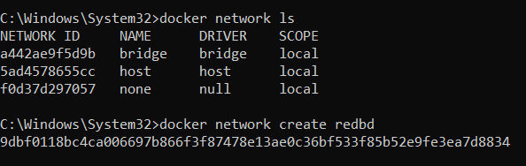

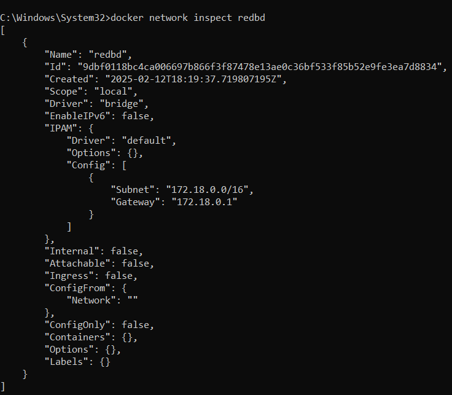

### 🐬 Crear el contenedor de MariaDB con comandos

Ejecutamos en la terminal:

```bash
$docker run -d --name mariadb-container \
  --network redbd \
  -e MYSQL_ROOT_PASSWORD=root \
  -e MYSQL_DATABASE=base \
  -e MYSQL_USER=daw \
  -e MYSQL_PASSWORD=daw \
  -p 3306:3306 \
  -v mariadb_data:/var/lib/mysql \
  mariadb:latest
```

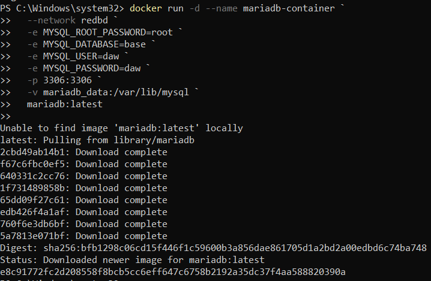

### 🐬 Crear el contenedor de MariaDB con Docker Desktop

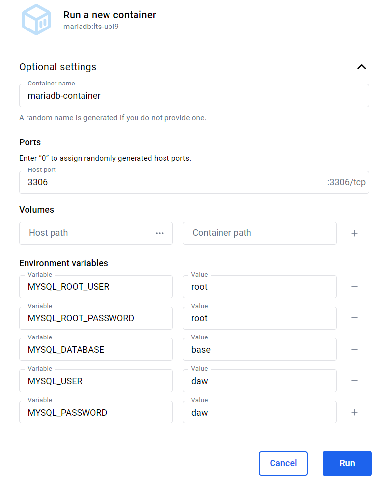

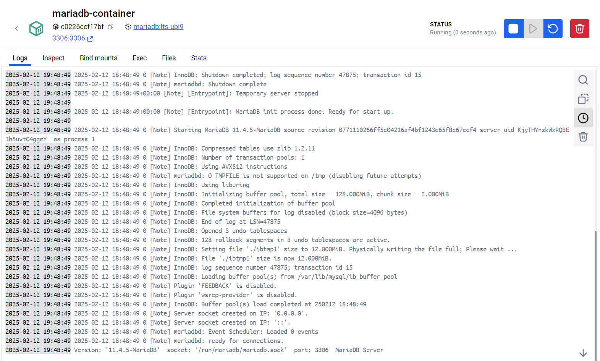

Podemos ver en los logs que el contenedor de MariaDB se ha iniciado correctamente. El sistema nos muestra una secuencia de mensajes de inicialización que confirman que la base de datos está lista para aceptar conexiones y que todos los componentes necesarios se han cargado correctamente.

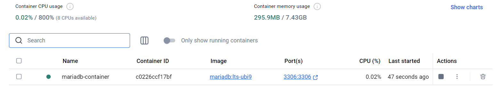

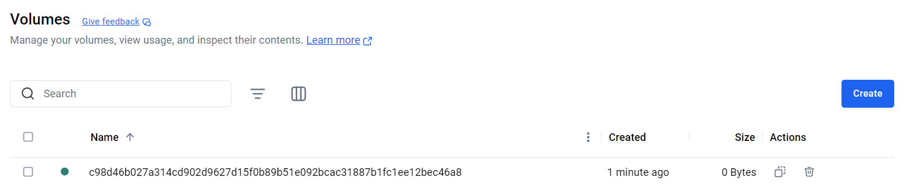

### üåê Crear el contenedor con Adminer o phpMyAdmin con comandos

```bash
$docker run -d --name adminer-container \
  --network redbd \
  -p 8080:8080 \
  adminer
```

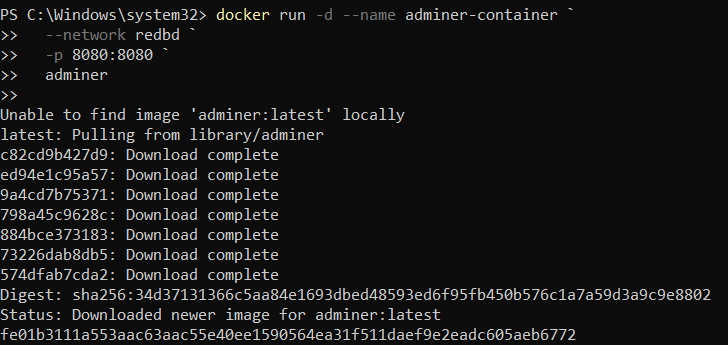

### üåê Crear el contenedor con Adminer o phpMyAdmin con Docker Desktop

- Vamos a la pestaña **"Images"** y hacemos clic en **"Run"** con la imagen de Adminer.
- En **"Advanced settings"**:
    - Nombre: `adminer-container`.
    - Host Port: `8080`.
- Hacemos clic en **"Run"**.

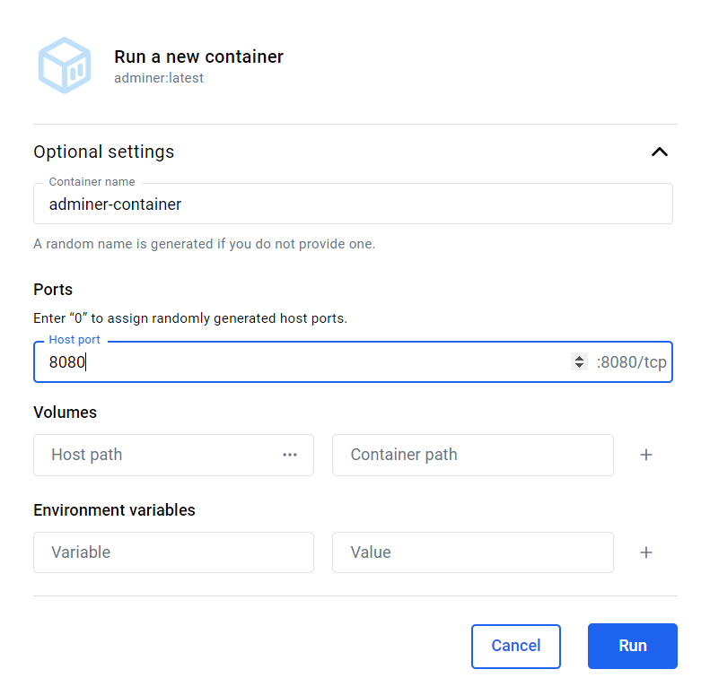

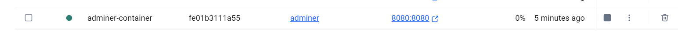

### 💻 Acceder a la base de datos desde la interfaz gráfica

Abrimos el navegador y vamos a `http://localhost:8080`.

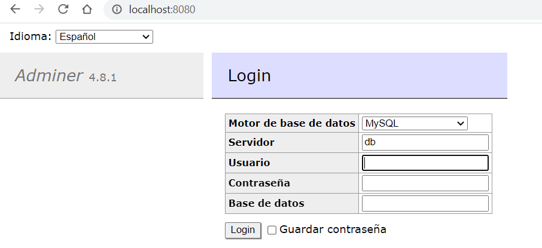

- Rellenamos los datos de conexión:
    - **Servidor**: `mariadb-container` (nombre del contenedor).
    - **Usuario**: `daw`.
    - **Contraseña**: `daw`.
    - **Base de datos**: `base`.
- Hacemos clic en **"Login"**.

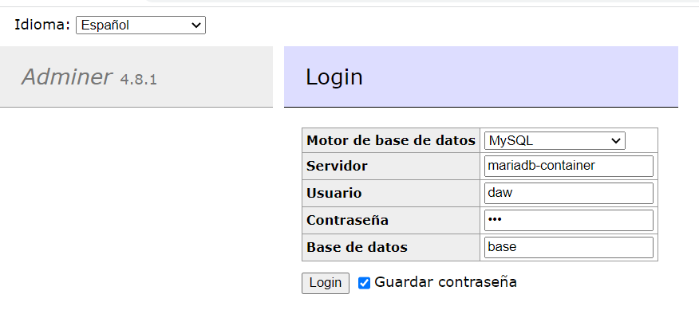

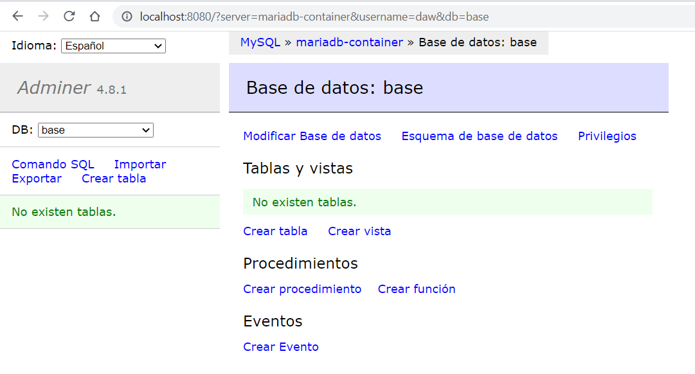

***Crear una Tabla en la Base de Datos***

- Entramos en la base de datos `base` y elegimos **"Crear tabla"**.
- Definimos una tabla de ejemplo:
  
  
    | Campo | Tipo | Clave primaria |
    | --- | --- | --- |
    | id | INT | ‚úÖ (Auto-incremental) |
    | nombre | VARCHAR(50) | ‚ùå |
- Guardamos los cambios.

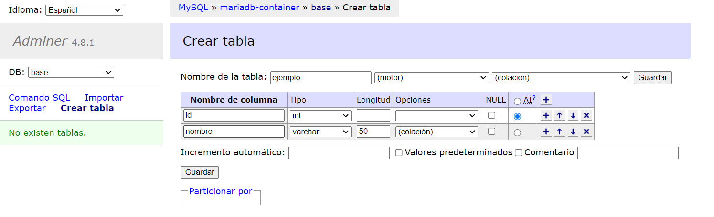

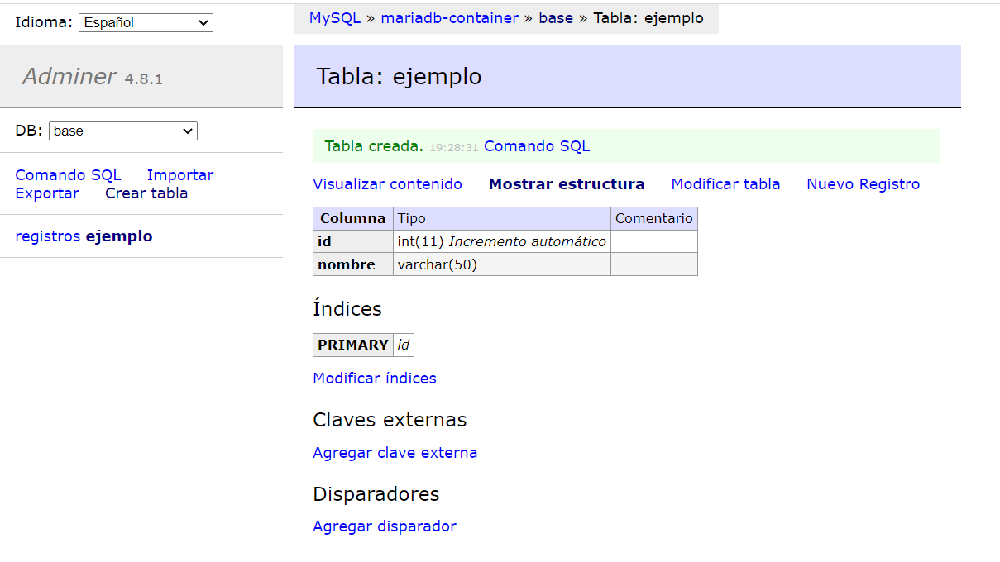

### üßπ Borrar los contenedores, la red y los vol√∫menes utilizados con comandos

```bash
$docker stop mariadb-container adminer
$docker rm mariadb-container adminer
$docker network rm my_network
$docker volume prune -f
```

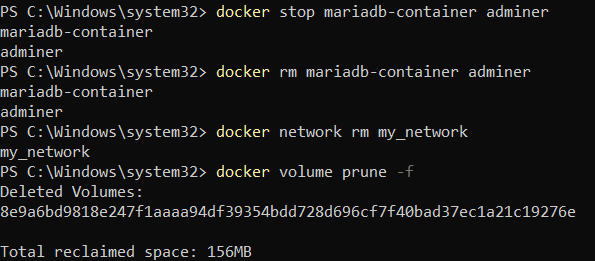

### üßπ Borrar los contenedores, la red y los vol√∫menes utilizados con Docker Desktop

Primero paramos los contenedores, haciendo click en Stop.

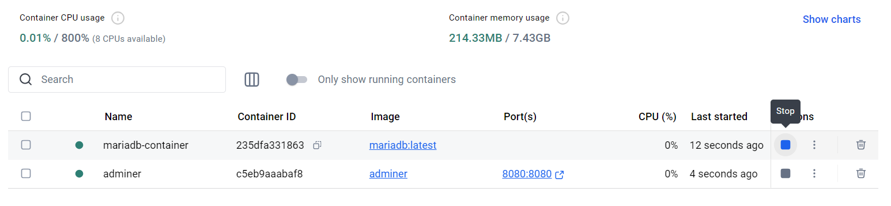

Y luego los borramos:

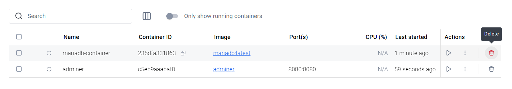

Una vez borrados podemos borrar sus imagenes:

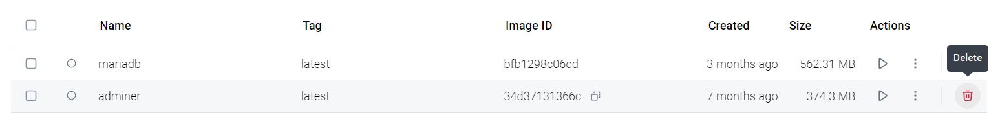

### 🏗️ Ejercicio 4: Docker Compose

***Crear el archivo `docker-compose.yaml` con comandos***

Abrimos una terminal y creamos una nueva carpeta para el proyecto, dentro de esta carpeta, creamos el archivo `docker-compose.yaml`. Para esto, usamos bloc de notas(o cualquier otro editor de texto):

```bash
$mkdir htop-docker && cd htop-docker
$notepad docker-compose.yaml
```


Pegamos el siguiente contenido en el archivo y luego lo guardamos y cerramos el bloc de notas:

```yaml
services:
  htop:
    image: terencewestphal/htop
    container_name: htop_container
    stdin_open: true
    tty: true
    command: htop
```

***Crear el archivo `docker-compose.yaml` sin comandos***

- Abrimos el **Explorador de archivos**.
- Creamos una carpeta llamada **htop-docker** en la misma ubicacion que lo estabamos haciendo con los comandos.


Abrimos **Visual Studio Code**, **Bloc de notas**, o cualquier editor de texto y escribimos:

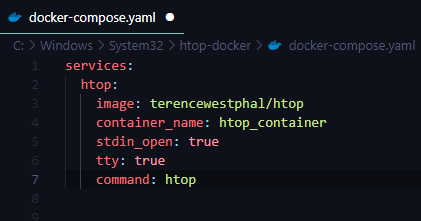

***Iniciar el contenedor con Docker Compose***
Ejecutamos el siguiente comando para iniciar **htop** en un contenedor y verificamos que el contenedor est√° corriendo:

```bash
$docker-compose up -d
$docker ps
```

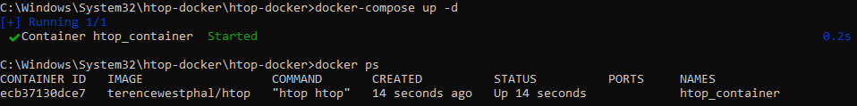

```bash
$docker exec -it htop_container htop
```

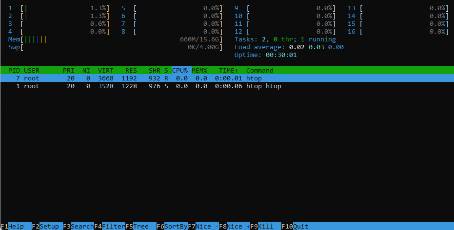

***Detener y eliminar el contenedor***

Primero, paramos la imagen y la borramos:

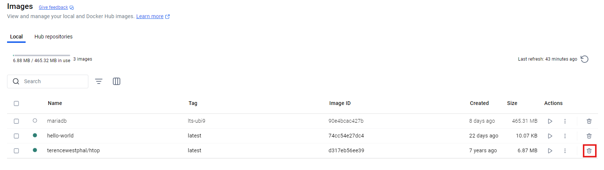

Y luego una vez paradas/borradas podemos borrar el conte

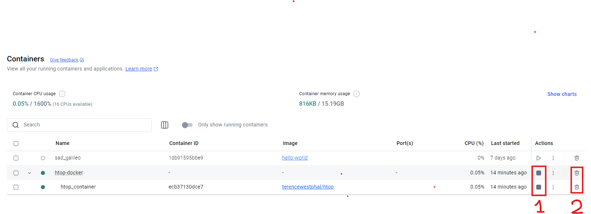

### 🏗️ Ejercicio 5: Imagen con Dockerfile - Aplicación Web

***Creación inicial del contenedor***

Descargamos la imagen base y creamos una carpeta para los archivos del sitio web con comandos:

```bash
$docker pull php:7.4-apache
$mkdir -p web_desplieguePelayoIker
$cd web_desplieguePelayoIker
```

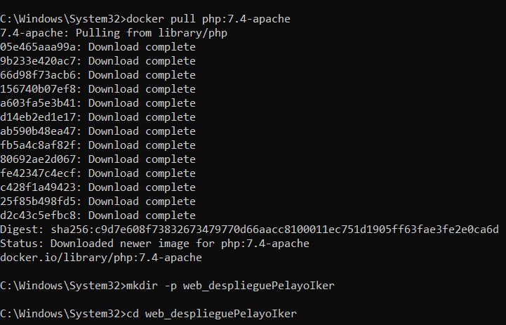

Descargamos la imagen base y creamos una carpeta para los archivos del sitio web sin comandos:

- En Docker Hub buscamos `php:7.4-apache` y descargamos la primera.
- Una vez descargada, en la pestaña **"Images"** (Imágenes), buscamos `php:7.4-apache`.
- Por √∫ltimo, creamos la carpeta manualmente y la llamamos `web_desplieguePelayoIker` .

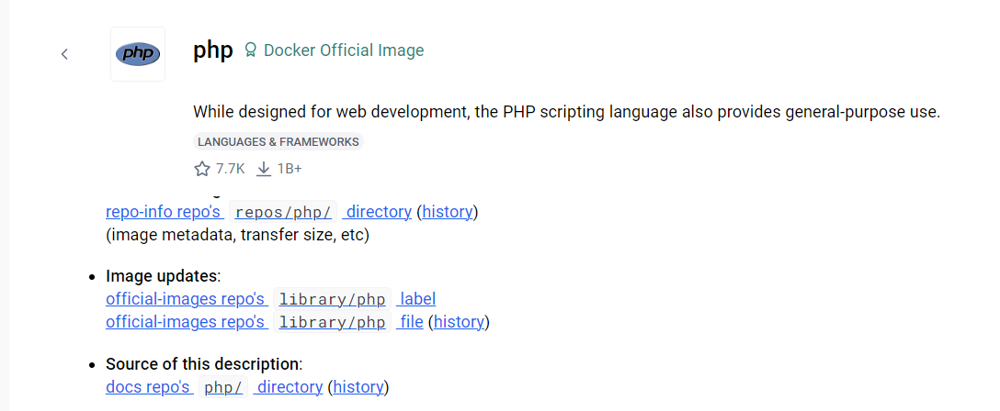

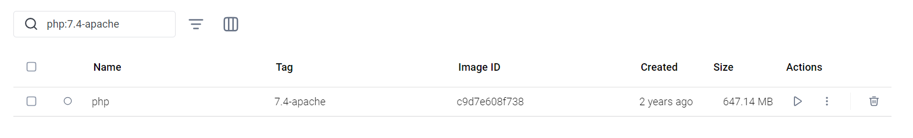

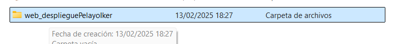

Una vez creada la carpeta, creamos los archivos del sitio.

Abrimos VS Code y creamos los archivos index.html  ,  styles.css  y  info.php.


📄 **Archivo `index.html`**

```html
<!DOCTYPE html>
<html lang="es">
<head>
    <meta charset="UTF-8">
    <meta name="viewport" content="width=device-width, initial-scale=1.0">
    <title>Sitio Web Pelayo e Iker</title>
    <link rel="stylesheet" href="styles.css">
</head>
<body>
    <h1>Bienvenidos al Sitio Web de Pelayo e Iker</h1>
    <p>Esta es nuestra p√°gina principal.</p>
    <p>Consulta la información del servidor <a href="info.php">aquí</a></p>
</body>
</html>

```

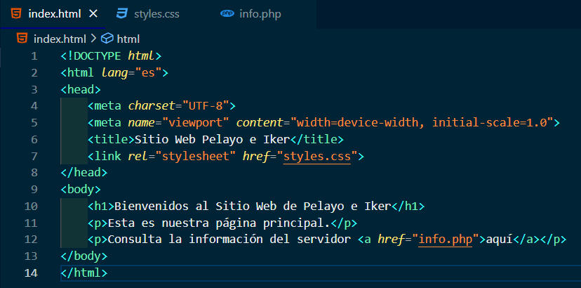

üé® **Archivo `styles.css`**

```css
body {
    font-family: 'Arial', sans-serif;
    margin: 0;
    padding: 0;
    background: linear-gradient(to right, #2c3e50, #4ca1af);
    color: #fff;
    text-align: center;
}

.container {
    width: 80%;
    margin: 50px auto;
    background: rgba(255, 255, 255, 0.1);
    padding: 20px;
    border-radius: 10px;
    box-shadow: 0px 0px 10px rgba(0, 0, 0, 0.2);
}

h1 {
    font-size: 2.5em;
    margin-bottom: 10px;
    color: #f1c40f;
}

p {
    font-size: 1.2em;
    line-height: 1.6;
}

@media (max-width: 768px) {
    .container {
        width: 90%;
    }

    h1 {
        font-size: 2em;
    }

    p {
        font-size: 1em;
    }
}
```

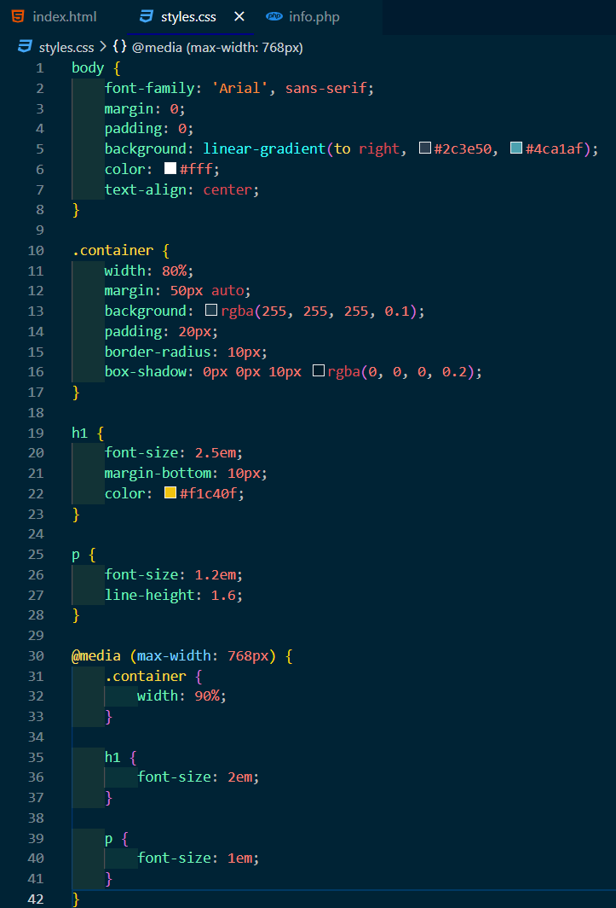

üñ• **Archivo `info.php`**

```php
<?php
setlocale(LC_TIME, "es_ES.UTF-8");
$mes_actual = strftime("%B");
$fecha_actual = date("d/m/Y");
$hora_actual = date("H:i:s");

echo "<h1>Información</h1>";
echo "<p>Hoy es $fecha_actual</p>";
echo "<p>El mes es: <strong>$mes_actual</strong></p>";
echo "<p>Hora: $hora_actual</p>";
?>
```

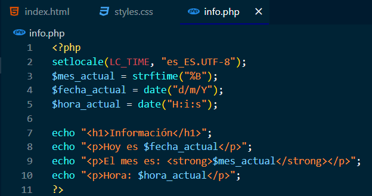

Ahora arrancamos el contenedor al que llamamos web y que sea accesible desde un navegador en el puerto 8000.

Con comados :

- `d`: Corre el contenedor en modo "detached" (en segundo plano).
- `-name web`: Nombre del contenedor.
- `p 8000:80`: Mapea el puerto 8000 del host al puerto 80 del contenedor.
- `v "$(pwd)":/var/www/html`: Monta la carpeta actual en `/var/www/html` dentro del contenedor.

```bash
$docker run -d --name web -p 8000:80 -v C:\Users\usuario\Documents\web_desplieguePelayoIker:/var/www/html php:7.4-apache 
```

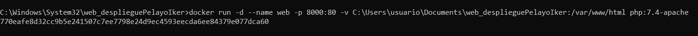

Desde docker desktop:

- Vamos a **“Images”** y clicamos Run en la imagen de `php:7.4-apache.`
- En optional settings, lo rellenamos con los siguientes datos:
    - Contianer Name: web.
    - Ports: Host Port: `8000`.
    - En Volumes: **Host Path"**, seleccionamos la carpeta donde guardamos nuestro sitio web(web_desplieguePelayoIker) y en Container Path(/var/www/html).
- Por √∫ltimo pinchamos en Run, para arrancar el contenedor.

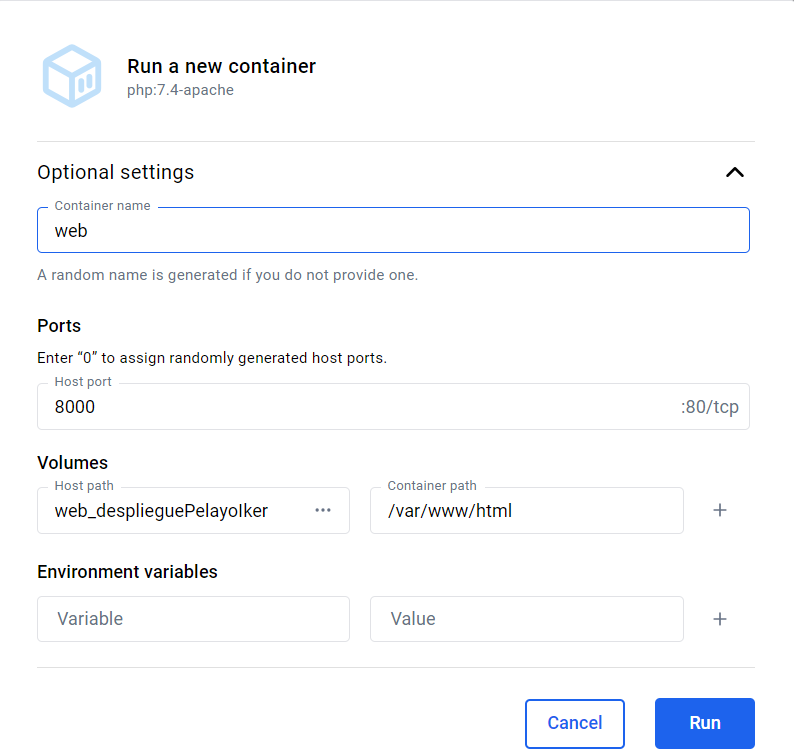

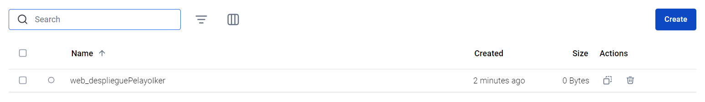

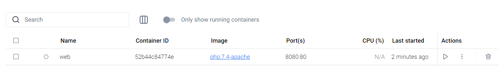

Vemos la salida del script y de la p√°gina index en el navegador:

- Abrimos el navegador y entramos a [http://localhost:8000](http://localhost:8000/).
- Para ver el info PHP, pinchamos en aquí o metemos este enlace [http://localhost:8000/info.php](http://localhost:8000/info.php).

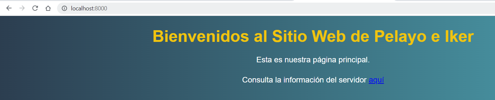

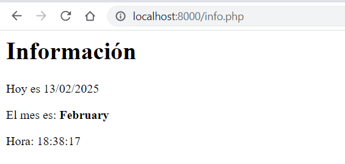

***Detenemos y eliminamos el contenedor con comandos***

```bash
$docker stop web
$docker rm web
```

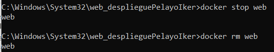

***Detenemos y eliminamos el contenedor desde Docker Desktop***

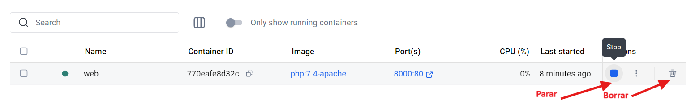

***Automatización de estas operaciones creando un fichero Dockerfile***
Creamos un `Dockerfile` en desde VS Code para construir la imagen autom√°ticamente.

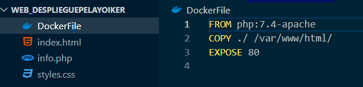

***Construcción de la imagen***

- Ejecutamos el siguiente comando en la carpeta donde est√° el `Dockerfile.`
- Verificamos la nueva imagen.


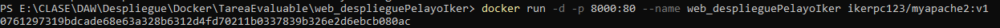

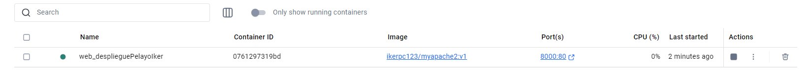

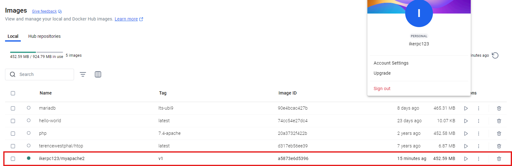

***Subimos la imagen a Docker Hub***

- Nos dirigimos a **“Images”** y buscamos la imagen que subimos.
- Para subirla a Docker Hub, hacemos clic en el icono de los tres puntos **(⋮)** y seleccionamos Push to Docker Hub.

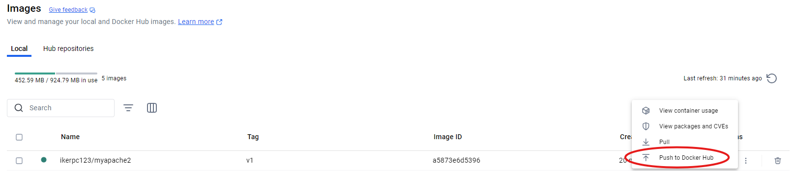

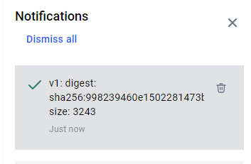

***Desplegar la imagen en otro equipo***

- Buscamos la imagen llamada ikerpc123/apache2.
- Descargamos la imagen desde Docker Hub en el otro equipo, haciendo click en **“Pull”.**

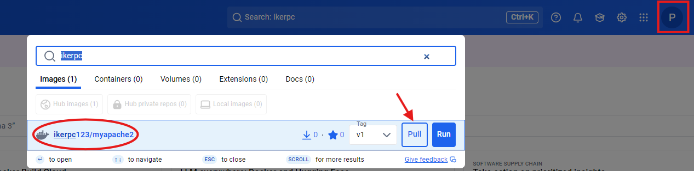

- Comprobamos que esta entre nuestras imagenes.

