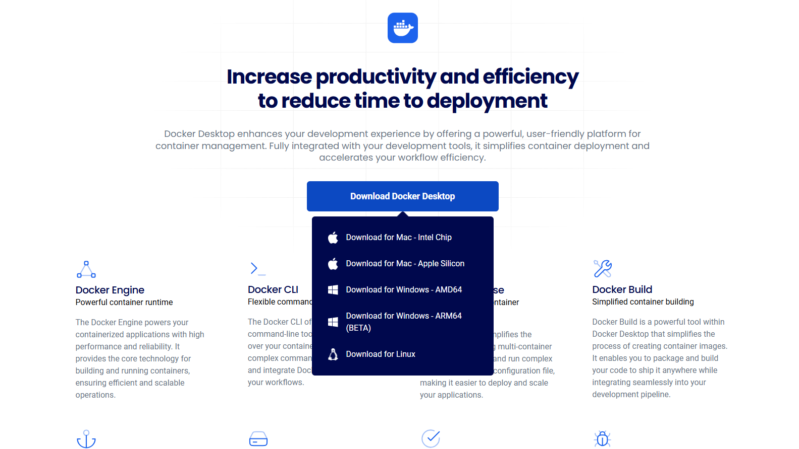

# Ejercicio 3

**CIFP La Laboral - Módulo Despliegue de Aplicaciones Web**

> 👥 **Autores:** Pelayo Rodríguez e Iker Pérez                                                                                                                              📌 **Fecha de entrega y exposición:** Viernes, 21 de febrero de 2025.                                                                                                                                     📂 **Repositorio GitHub:** ‣
> 

# 📑 ÍNDICE

### 🌐 Ejercicio 3: Contenedores en Red

### 🛠️ Crear una red bridge (redbd)

En **Docker Desktop**, no hay una sección visual para redes en la interfaz, pero podemos verlas y administrarlas con comandos Docker.

Primero listamos las redes, luego, creamos la red bridge pedida y por ultimo vemos los detalles de esa red y comprobamos que se ha creado correctamente:

```bash
 $docker network ls
 $docker network create redbd
 $docker network inspect redbd
```




### 🐬 Crear el contenedor de MariaDB con comandos

Ejecutamos en la terminal:

```bash
$docker run -d --name mariadb-container \
  --network redbd \
  -e MYSQL_ROOT_PASSWORD=root \
  -e MYSQL_DATABASE=base \
  -e MYSQL_USER=daw \
  -e MYSQL_PASSWORD=daw \
  -p 3306:3306 \
  -v mariadb_data:/var/lib/mysql \
  mariadb:latest
```


### 🐬 Crear el contenedor de MariaDB con Docker Desktop


Podemos ver en los logs que el contenedor de MariaDB se ha iniciado correctamente. El sistema nos muestra una secuencia de mensajes de inicialización que confirman que la base de datos está lista para aceptar conexiones y que todos los componentes necesarios se han cargado correctamente.


### 🌐 Crear el contenedor con Adminer o phpMyAdmin con comandos

```bash
$docker run -d --name adminer-container \
  --network redbd \
  -p 8080:8080 \
  adminer
```


### 🌐 Crear el contenedor con Adminer o phpMyAdmin con Docker Desktop

- Vamos a la pestaña **"Images"** y hacemos clic en **"Run"** con la imagen de Adminer.
- En **"Advanced settings"**:
    - Nombre: `adminer-container`.
    - Host Port: `8080`.
- Hacemos clic en **"Run"**.


### 💻 Acceder a la base de datos desde la interfaz gráfica

Abrimos el navegador y vamos a `http://localhost:8080`.


- Rellenamos los datos de conexión:
    - **Servidor**: `mariadb-container` (nombre del contenedor).
    - **Usuario**: `daw`.
    - **Contraseña**: `daw`.
    - **Base de datos**: `base`.
- Hacemos clic en **"Login"**.


***Crear una Tabla en la Base de Datos***

- Entramos en la base de datos `base` y elegimos **"Crear tabla"**.
- Definimos una tabla de ejemplo:
  
  
    | Campo | Tipo | Clave primaria |
    | --- | --- | --- |
    | id | INT | ✅ (Auto-incremental) |
    | nombre | VARCHAR(50) | ❌ |
- Guardamos los cambios.


### 🧹 Borrar los contenedores, la red y los volúmenes utilizados con comandos

```bash
$docker stop mariadb-container adminer
$docker rm mariadb-container adminer
$docker network rm my_network
$docker volume prune -f
```


### 🧹 Borrar los contenedores, la red y los volúmenes utilizados con Docker Desktop

Primero paramos los contenedores, haciendo click en Stop.


Y luego los borramos:


Una vez borrados podemos borrar sus imagenes:

