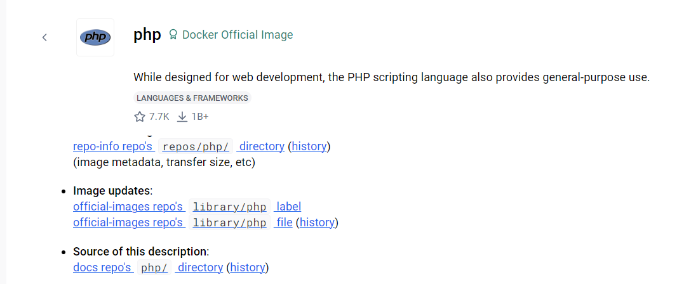
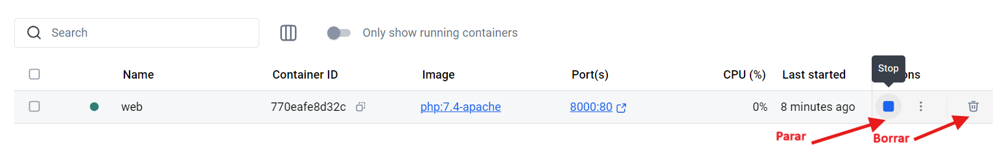
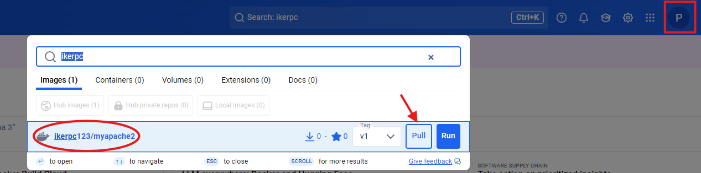
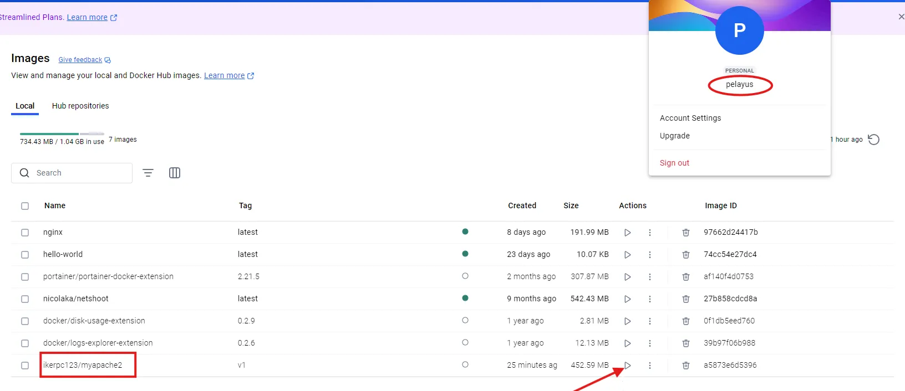

# Ejercicio 5

**CIFP La Laboral - Módulo Despliegue de Aplicaciones Web**

> 👥 **Autores:** Pelayo Rodríguez e Iker Pérez                                                                                                                                  📌 **Fecha de entrega y exposición:** Viernes, 21 de febrero de 2025.                                                                                                                                     📂 **Repositorio GitHub:** ‣
> 

# 📑 ÍNDICE

[TOC]

## 📖 Ejercicios

### 🏗️ Ejercicio 5: Imagen con Dockerfile - Aplicación Web

***Creación inicial del contenedor***

Descargamos la imagen base y creamos una carpeta para los archivos del sitio web con comandos:

```bash
$docker pull php:7.4-apache
$mkdir -p web_desplieguePelayoIker
$cd web_desplieguePelayoIker
```


Descargamos la imagen base y creamos una carpeta para los archivos del sitio web sin comandos:

- En Docker Hub buscamos `php:7.4-apache` y descargamos la primera.
- Una vez descargada, en la pestaña **"Images"** (Imágenes), buscamos `php:7.4-apache`.
- Por último, creamos la carpeta manualmente y la llamamos `web_desplieguePelayoIker` .




Una vez creada la carpeta, creamos los archivos del sitio.

Abrimos VS Code y creamos los archivos index.html  ,  styles.css  y  info.php.


📄 **Archivo `index.html`**

```html
<!DOCTYPE html>
<html lang="es">
<head>
    <meta charset="UTF-8">
    <meta name="viewport" content="width=device-width, initial-scale=1.0">
    <title>Sitio Web Pelayo e Iker</title>
    <link rel="stylesheet" href="styles.css">
</head>
<body>
    <h1>Bienvenidos al Sitio Web de Pelayo e Iker</h1>
    <p>Esta es nuestra página principal.</p>
    <p>Consulta la información del servidor <a href="info.php">aquí</a></p>
</body>
</html>

```


🎨 **Archivo `styles.css`**

```css
body {
    font-family: 'Arial', sans-serif;
    margin: 0;
    padding: 0;
    background: linear-gradient(to right, #2c3e50, #4ca1af);
    color: #fff;
    text-align: center;
}

.container {
    width: 80%;
    margin: 50px auto;
    background: rgba(255, 255, 255, 0.1);
    padding: 20px;
    border-radius: 10px;
    box-shadow: 0px 0px 10px rgba(0, 0, 0, 0.2);
}

h1 {
    font-size: 2.5em;
    margin-bottom: 10px;
    color: #f1c40f;
}

p {
    font-size: 1.2em;
    line-height: 1.6;
}

@media (max-width: 768px) {
    .container {
        width: 90%;
    }

    h1 {
        font-size: 2em;
    }

    p {
        font-size: 1em;
    }
}
```


🖥 **Archivo `info.php`**

```php
<?php
setlocale(LC_TIME, "es_ES.UTF-8");
$mes_actual = strftime("%B");
$fecha_actual = date("d/m/Y");
$hora_actual = date("H:i:s");

echo "<h1>Información</h1>";
echo "<p>Hoy es $fecha_actual</p>";
echo "<p>El mes es: <strong>$mes_actual</strong></p>";
echo "<p>Hora: $hora_actual</p>";
?>
```


Ahora arrancamos el contenedor al que llamamos web y que sea accesible desde un navegador en el puerto 8000.

Con comados :

- `d`: Corre el contenedor en modo "detached" (en segundo plano).
- `-name web`: Nombre del contenedor.
- `p 8000:80`: Mapea el puerto 8000 del host al puerto 80 del contenedor.
- `v "$(pwd)":/var/www/html`: Monta la carpeta actual en `/var/www/html` dentro del contenedor.

```bash
$docker run -d --name web -p 8000:80 -v C:\Users\usuario\Documents\web_desplieguePelayoIker:/var/www/html php:7.4-apache 
```


Desde docker desktop:

- Vamos a **“Images”** y clicamos Run en la imagen de `php:7.4-apache.`
- En optional settings, lo rellenamos con los siguientes datos:
    - Contianer Name: web.
    - Ports: Host Port: `8000`.
    - En Volumes: **Host Path"**, seleccionamos la carpeta donde guardamos nuestro sitio web(web_desplieguePelayoIker) y en Container Path(/var/www/html).
- Por último pinchamos en Run, para arrancar el contenedor.


Vemos la salida del script y de la página index en el navegador:

- Abrimos el navegador y entramos a [http://localhost:8000](http://localhost:8000/).
- Para ver el info PHP, pinchamos en aquí o metemos este enlace [http://localhost:8000/info.php](http://localhost:8000/info.php).


***Detenemos y eliminamos el contenedor con comandos***

```bash
$docker stop web
$docker rm web
```


***Detenemos y eliminamos el contenedor desde Docker Desktop***



***Automatización de estas operaciones creando un fichero Dockerfile***
Creamos un `Dockerfile` en desde VS Code para construir la imagen automáticamente.


***Construcción de la imagen***

- Ejecutamos el siguiente comando en la carpeta donde está el `Dockerfile.`
- Verificamos la nueva imagen.


***Subimos la imagen a Docker Hub***

- Nos dirigimos a **“Images”** y buscamos la imagen que subimos.
- Para subirla a Docker Hub, hacemos clic en el icono de los tres puntos **(⋮)** y seleccionamos Push to Docker Hub.


***Desplegar la imagen en otro equipo***

- Buscamos la imagen llamada ikerpc123/apache2.
- Descargamos la imagen desde Docker Hub en el otro equipo, haciendo click en **“Pull”.**



- Comprobamos que esta entre nuestras imagenes.

