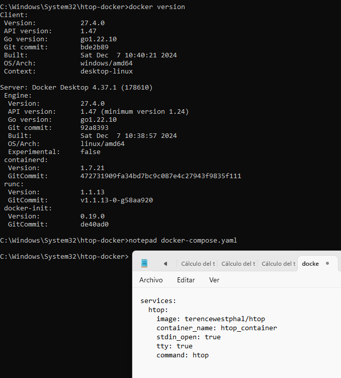

# Ejercicio 4

**CIFP La Laboral - Módulo Despliegue de Aplicaciones Web**

> 👥 **Autores:** Pelayo Rodríguez e Iker Pérez                                                                                                                                   📌 **Fecha de entrega y exposición:** Viernes, 21 de febrero de 2025.                                                                                                                                     📂 **Repositorio GitHub:** ‣
> 

# 📑 ÍNDICE

1. Crear el archivo docker-compose.yaml 
    - 1.1. Con comandos
    - 1.2. Sin comandos
2. Iniciar el contenedor con Docker Compose 
    - 2.1. Verificación del contenedor en ejecución
    - 2.2. Acceso al contenedor
3. Detener y eliminar el contenedor 
    - 3.1. Parar la imagen
    - 3.2. Eliminar contenedores

### 🏗️ Ejercicio 4: Docker Compose

***Crear el archivo `docker-compose.yaml` con comandos***

Abrimos una terminal y creamos una nueva carpeta para el proyecto, dentro de esta carpeta, creamos el archivo `docker-compose.yaml`. Para esto, usamos bloc de notas(o cualquier otro editor de texto):

```bash
$mkdir htop-docker && cd htop-docker
$notepad docker-compose.yaml
```



Pegamos el siguiente contenido en el archivo y luego lo guardamos y cerramos el bloc de notas:

```yaml
services:
  htop:
    image: terencewestphal/htop
    container_name: htop_container
    stdin_open: true
    tty: true
    command: htop
```

***Crear el archivo `docker-compose.yaml` sin comandos***

- Abrimos el **Explorador de archivos**.
- Creamos una carpeta llamada **htop-docker** en la misma ubicacion que lo estabamos haciendo con los comandos.


Abrimos **Visual Studio Code**, **Bloc de notas**, o cualquier editor de texto y escribimos:


***Iniciar el contenedor con Docker Compose***
Ejecutamos el siguiente comando para iniciar **htop** en un contenedor y verificamos que el contenedor está corriendo:

```bash
$docker-compose up -d
$docker ps
```


```bash
$docker exec -it htop_container htop
```


***Detener y eliminar el contenedor***

Primero, paramos la imagen y la borramos:


Y luego una vez paradas/borradas podemos borrar el conte

