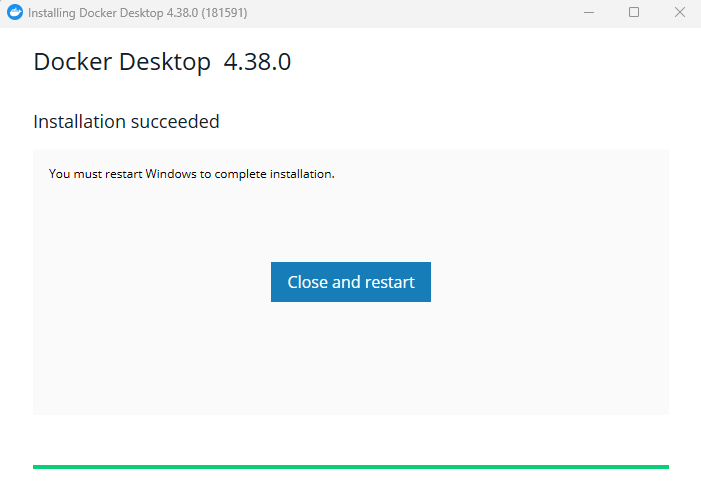

# Ejercicio 1

**CIFP La Laboral - Módulo Despliegue de Aplicaciones Web**

> 👥 **Autores:** Pelayo Rodríguez e Iker Pérez                                                                                                                                   📌 **Fecha de entrega y exposición:** Viernes, 21 de febrero de 2025.                                                                                                                                     📂 **Repositorio GitHub:** ‣
> 

# 📑 ÍNDICE

### 🖥️ Ejercicio 1: Manual de Docker Desktop

### 💾 Proceso paso a paso de instalación

- **Abrimos el navegador** y accedemos a la página oficial de Docker:

  👉[🔗 Página oficial de Docker Desktop](https://www.docker.com/products/docker-desktop)

- Bajamos un poco pinchamos en Download Docker Desktop y lo descargamos para Windows.


Una vez descargado, pinchamos en el instalador y comenzamos con la descarga:




Una vez realizada la instalación, accedemos a Docker Desktop:

Nada mas entrar nos pedirá iniciar sesión o registrarnos:


Una vez hecho, ya accedemos a Docker Desktop y a todas sus funcionalidades: 


### 🖥️ Navegación por la interfaz principal


### 📦 Operaciones básicas con contenedores

***Ver Contenedores Disponibles***

- Abrimos **Docker Desktop**.
- En la barra lateral izquierda, seleccionamos **Containers**.
- Se muestra una lista con los contenedores creados, indicando su estado (corriendo, detenido, etc.).


***Iniciar un Contenedor Detenido***

- Ubicamos el contenedor en la lista.
- Si el estado es "Exited", hacemos clic en los tres puntos **(⋮)** a la derecha del contenedor.
- Seleccionamos Restart para reiniciarlo.


***Detener un Contenedor en Ejecución***

- Usamos el contenedor en ejecución.
- Le damos a los tres puntos **(⋮)**.
- Selecciona **Pause** o **Stop** según sea necesario.


***Eliminar un Contenedor***

- Nos aseguramos de que el contenedor está detenido.
- Hacemos clic en los tres puntos **(⋮)** a la derecha del contenedor.
- Seleccionamos el icono de **Eliminar** para eliminarlo.


***Ver Detalles de un Contenedor***

- Hacemos clic en los tres puntos **(⋮)** a la derecha del contenedor.
- Seleccionamos view details.
- Al entrar, podemos ver información como logs, configuración y estadísticas de uso.


***Copiar el Comando de Ejecución de un Contenedor***

- Hacemos clic en los tres puntos **(⋮)** junto al contenedor.
- Seleccionamos **Copy docker run** para copiar el comando con el que fue creado.


***Ver Archivos de un Contenedor***

- Hacemos clic en los tres puntos **(⋮)**.
- Seleccionamos **View files** para explorar los archivos dentro del contenedor.


## 🏷️ Gestión de imágenes Docker

***Ver las Imágenes Disponibles***

- En la barra lateral izquierda, seleccionamos **Images**.
- Se nos muestra la lista de imágenes descargadas en el sistema.


***Descargar una Imagen desde Docker Hub***

- Descargamos la imagen manualmente con:

```bash
$docker pull nginx:latest
```

- Vamos a la pestaña **Images**.
- Hacemos clic en el botón **Pull** (Descargar).
- Escribimos el nombre de la imagen y su versión, por ejemplo:

```bash
$nginx:latest
```

- Haz clic en **Pull** para descargar la imagen.


***Eliminar una Imagen***

1. Encontramos la imagen que queremos borrar en la pestaña **Images**.
2. Hacemos clic en el icono de los tres puntos **(⋮)** a la derecha.
3. Seleccionamos **Delete** para eliminar la imagen.


No se pueden eliminar imágenes que están en uso por un contenedor en ejecución:


***Crear una Imagen Personalizada***

- Escribimos un **Dockerfile** con la configuración de la imagen.
- Usamos el siguiente comando en la terminal:
    
    ```bash
    $docker build -t mi-imagen .
    ```
    
- Posteriormente, la imagen nos aparece en la pestaña **Images**.

***Ejecutar un Contenedor desde una Imagen***

- Encontramos la imagen que queremos ejecutar.
- Hacemos clic en **Run**.
- Configuramos los puertos y volúmenes si es necesario y hacemos clic en Run.


### 🔌 Configuración de redes y volúmenes

***Ver las redes disponibles***

- En la barra lateral, seleccionamos **Containers**.
- Hacemos clic en un contenedor existente y seleccionamos **View details**.
- En la pestaña **Network**, vemos las redes asociadas al contenedor.


***Crear una Nueva Red***

Docker Desktop no ofrece una opción nativa para añadir redes directamente desde su interfaz, pero podemos utilizar extensiones de terceros para ampliar su funcionalidad.

- Hacemos clic en la pestaña **Extensions** en la barra lateral izquierda.
- En el Marketplace de Extensiones, buscamos **Portainer**.
- Hacemos clic en **Install** para añadir la extensión.


- Configuramos el entorno

Al iniciar Portainer por primera vez, verás la pantalla de "Quick Setup" (como en tu imagen). Aquí puedes:

- **"Get Started"**: Gestionamos el entorno local de Docker donde se ejecuta Portainer.


- **"Add Environments"**: Agregamos otros entornos remotos, como clústeres de Kubernetes o instancias Docker en servidores.


- Administramos contenedores

Desde el panel de control de Portainer, puedes:

- Crear, iniciar, detener y eliminar contenedores.
- Ver logs y estadísticas de rendimiento.
- Gestionar imágenes y volúmenes de Docker.
- Configurar redes y stacks con Docker Compose.

### 🔧 Herramientas de diagnóstico

### **Disk Usage (Uso de Disco)**

- Muestra cuánto espacio ocupan las imágenes, contenedores y volúmenes.
- Ideal si Docker usa demasiado espacio en disco.


- Una vez instalada, vamos a **"Extensions" > "Disk Usage"**.
- Revisamos el uso de espacio y liberamos lo que no necesitemos.


### **Logs Explorer (Explorador de Logs)**

- Permite ver los logs de todos los contenedores sin usar la terminal.
- Muy útil para detectar errores sin ejecutar `docker logs`.


- Vamos a **"Extensions" > "Logs Explorer"**.
- Seleccionamos el contenedor que queremos analizar y revisamos los logs en la interfaz.

